# UI Design 

> A curated list of useful resources related to User Interface Design

* Use <kbd>Ctrl</kbd> + <kbd>F</kbd> or <kbd>Cmd</kbd> + <kbd>F</kbd> to search faster :wink:
* If you find it useful, help me spread the word :metal:
* If you want to contribute or be aware --> Fork, Star or Watch :raised_hands:
* If you like: 

## Contents

- [Learn](#learn)
	- [Principles](#principles)
	- [Books](#books)
	- [Articles](#articles)
	- [Disciplines](#disciplines)
	- [Courses](#courses)
	- [Design Systems](#design-systems)
	- [Patterns](#patterns)
	- [Techniques](#techniques)
	- [Newsletters](#newsletters)
	- [Websites & Blogs](#websites--blogs)
	- [Communities](#communities)
- [Tools](#tools)
	- [Pen & Paper](#pen--paper) ;)
	- [Design Apps](#design-apps)
	- [Complementary tools](#complementary-tools)
	- [Testing Apps](#testing-apps)
	- [Languages](#languages)
	- [Libraries & Frameworks](#libraries--frameworks)
	- [Tools](#tools)
- [Resources](#resources)
	- [Inspiration](#inspiration)
	- [Freebies](#freebies)
	- [APIs](#apis)

## Learn

### Principles

- :star: [Principles of User Interface Design](https://principles.design/examples/principles-of-user-interface-design) - 19 Principles by Joshua Porter.

- [10 Usability Heuristics for User Interface Design](https://www.nngroup.com/articles/ten-usability-heuristics/) - They are called "heuristics" because they are broad rules of thumb and not specific usability guidelines, by Jakob Nielsen.

- [First Principles of Interaction Design (Revised & Expanded)](http://asktog.com/atc/principles-of-interaction-design/) - The following principles are fundamental to the design and implementation of effective interfaces, whether for traditional GUI environments, the web, mobile devices, wearables, or Internet-connected smart devices, by Bruce Tognazzini.

- [Principles of user interface design](https://en.wikipedia.org/wiki/Principles_of_user_interface_design) - 6 principles by Constantine/Lockwood.

- [20 Guiding Principles for Experience Design](https://principles.design/examples/20-guiding-principles-for-experience-design) - A set of guiding principles for experience design — which anyone who touches a product used by humans should strive to follow, by Whitney Hess.

- [Dieter Rams' ten principles for good design](https://www.vitsoe.com/us/about/good-design) - These design principles from the legendary product designer Dieter Rams has influenced not only the iconic product designs from Braun in the 1960s, but also the design of Apple's products.

- [Principles of Calm Technology](https://calmtech.com/) - When we design products, we aim to choose the best position for user interface components, placing the most important ones in the most accessible places on the screen.

- [Laws of UX](https://lawsofux.com/) - Laws of UX is a collection of the key maxims that designers must consider when building user interfaces.

- [Shneiderman’s Eight Golden Rules Will Help You Design Better Interfaces](https://www.interaction-design.org/literature/article/shneiderman-s-eight-golden-rules-will-help-you-design-better-interfaces) - Apple, Google and Microsoft are among some of the highly successful companies whose well-designed products reflect Shneiderman’s rules.

- [Principles of bot design](https://www.intercom.com/blog/principles-bot-design/) - Despite plenty of excitement it’s still unclear how conversational UIs can be made to work in a practical sense. But opinionated design principles can help us push past the hype, and design something real people will want to use every day, by Intercom.

- [Heuristic Principles for Mobile Interfaces](https://www.toptal.com/designers/usability/mobile-heuristic-principles) - Search the web for heuristic principles and a long list of slightly varied sets will populate. Here is a curated collection of ten principles that are inspired by human-centered design and usability thought leaders.

- [Principles of Universal Design](http://universaldesign.ie/What-is-Universal-Design/The-7-Principles/) - These principles may be applied to evaluate existing designs, guide the design process and educate both designers and consumers about the characteristics of more usable products and environments.

- [The 4 Golden Rules of UI Design](https://xd.adobe.com/ideas/process/ui-design/4-golden-rules-ui-design/) - To increase the chances of success when creating user interfaces, most designers follow interface design principles. Interface design principles represent high-level concepts that are used to guide software design. In this article, I’ll share a few fundamental principles.

[back to table of contents](#user-content-contents)

### Books

| Cover | Title | Author |
| ----- | ----- | ------ |
| 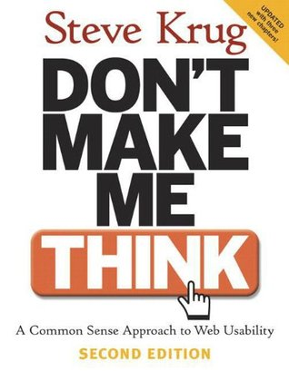 | :star: **Don't Make Me Think: A Common Sense Approach to Web Usability** - Steve Krug’s guide to help you understand the principles of intuitive navigation and information design. Witty, commonsensical, and eminently practical, it’s one of the best-loved and most recommended books on the subject. [Review](https://www.sitepoint.com/review-dont-make-me-think/) | Steve Krug |
| 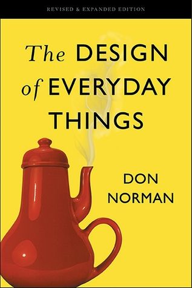 | :star: **The Design of Everyday Things** - In this entertaining and insightful analysis, cognitive scientist Don Norman hails excellence of design as the most important key to regaining the competitive edge in influencing consumer behavior.  [Review 1](https://jonathannicol.com/blog/2011/05/14/book-review-the-design-of-everyday-things/) / [Review 2](https://medium.com/@andyngj/book-review-insights-the-design-of-everyday-things-by-don-norman-fc10bc7355a5) | Donald A. Norman |
| 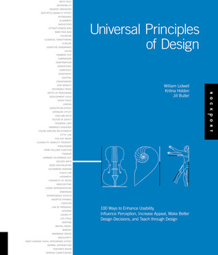 | **The Universal Principles of Design** - The first cross-disciplinary reference of design. Richly illustrated and easy to navigate, this book pairs clear explanations of the design concepts featured with visual examples of those concepts applied in practice. [Website](http://universalprinciplesofdesign.com/) / [Review](http://www.lizengland.com/blog/2016/05/review-universal-principles-of-design-by-william-lidwell-kritina-holden-and-jill-butcher/) | Lidwell, Holden, & Butler |
| 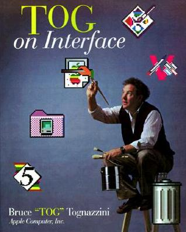 | **Tog on Interface** - Using ideas from such diverse sources as Information Theory, Carl Jung, and even professional beekeeping, the book provides a framework for achieving a deep understanding of user interface design. [Review](https://www.perlmonks.org/?node_id=144881) | Bruce Tognazzini |
| 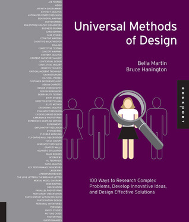 | **Universal Methods of Design: 100 Ways to Research Complex Problems, Develop Innovative Ideas, and Design Effective Solutions** - This books serves as an invaluable compendium of methods that can be easily referenced and utilized by cross-disciplinary teams in nearly any design project. [Review](https://uxmag.com/articles/universal-methods-of-design-book-review) | Hanington & Martin |
| 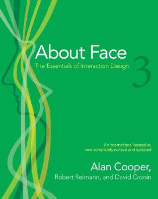 | **About Face: The Essentials of Interaction Design** - You'll learn the principles of good product behavior and gain an understanding of Cooper's Goal-Directed Design method, which involves everything from conducting user research to defining your product using personas and scenarios. [Review](https://www.geoff-hart.com/articles/2008/aboutface.htm) | Cooper, Reimann & Cronin |
| 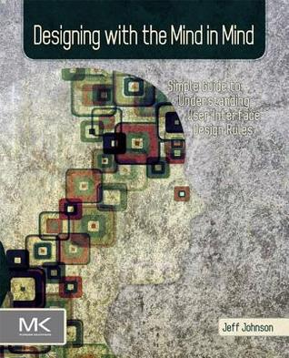 | **Designing with the Mind in Mind: Simple Guide to Understanding User Interface Design Rules** - Jeff Johnson presents the first practical guide to help designers and developers understand the psychology behind these tried and tested user interface design rules. [Review](https://jeremybytes.blogspot.com/2013/10/book-review-designing-with-mind-in-mind.html) | Jeff Johnson |
| 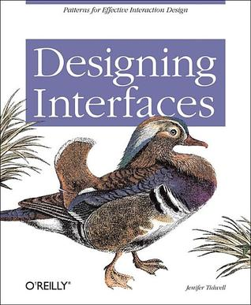 | **Designing Interfaces: Patterns for Effective Interaction Design** - UI designers over the years have refined the art of interface design, evolving many best practices and reusable ideas. If you learn these, and understand why the best user interfaces work so well, you too can design engaging and usable interfaces with less guesswork and more confidence. [Review](https://www.uxmatters.com/mt/archives/2006/11/book-review-designing-interfaces.php)| Jenifer Tidwell |
| 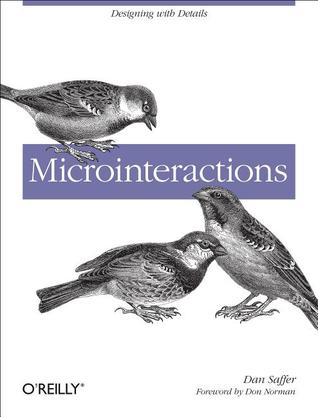 | **Microinteractions: Designing with Details** - This book provides a new way of thinking about designing digital products: as a series of microinteractions that are essential to bringing personality and delight to applications and devices. [Website](http://microinteractions.com/about-the-book/) / [Review](https://marcabraham.com/2013/07/10/book-review-microinteractions-designing-with-details/) | Dan Saffer |
|  | **How to Make Sense of Any Mess** - This book outlines a step-by-step process for making sense of messes made of information (and people). [Website](http://www.howtomakesenseofanymess.com/) / [Review](https://thorprojects.com/blog/archive/2018/07/02/book-review-how-to-make-sense-of-any-mess/) | Abby Covert |
| 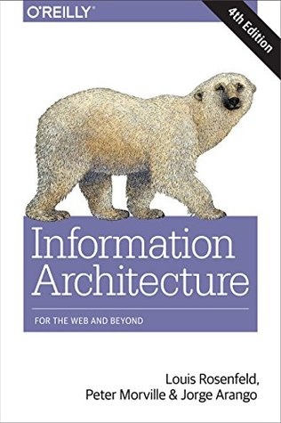 | **Information Architecture: For the Web and Beyond** - Anyone involved in digital design will learn how to create semantic structures that will help people engage with your message. [Review](https://medium.com/@howieyeo/book-review-information-architecture-for-the-web-and-beyond-52ff934714e9) | Rosenfeld, Morville & Arango |
|  | **The Elements of User Experience: User-Centered Design for the Web** - The author gives readers the big picture of Web user experience development, from strategy and requirements to information architecture and visual design. [Review](https://www.sitepoint.com/user-centered-design-web/) | Jesse James Garrett |
| 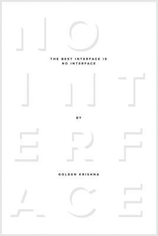 | **The Best Interface Is No Interface: The Simple Path to Brilliant Technology** - This book challenges our world of nagging, screen-based bondage, and shows how we can build a technologically advanced world without digital interfaces. [Review](https://nickfogle.com/review-the-best-interface-is-no-interface/) | Golden Krishna |
| 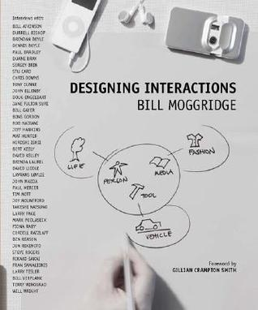 | **Designing Interactions** - In the book, Bill Moggridge introduces us to 40 influential designers who have shaped our interaction with technology. [Website](http://www.designinginteractions.com/) / [Review](https://www.pdma.org/page/review_designing_int)| Bill Moggridge |
| 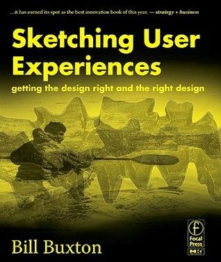 | **Sketching User Experiences: Getting the Design Right and the Right Design** - The book approaches design and design thinking as something distinct that needs to be better understood-by both designers and the people with whom they need to work- in order to achieve success with new products and systems. [Review](https://www.uxmatters.com/mt/archives/2007/10/book-review-sketching-user-experiences.php) | Bill Buxton |
| 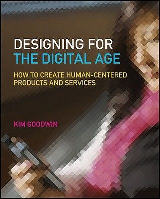 | **Designing for the Digital Age: How to Create Human-Centered Products and Services** - This comprehensive, full-color volume addresses project management, user research, and consensus-building problems with detailed how-to information, real-life examples, and exercises. [Review](https://www.geoff-hart.com/articles/2010/goodwin-review.htm) | Kim Goodwin |
| 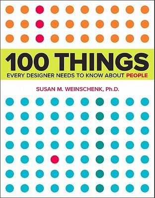 | **100 Things Every Designer Needs to Know about People** - This book combines real science and research with practical examples to deliver a guide every designer needs. [Review](https://medium.com/uxwell-education/book-review-100-things-every-designer-needs-to-know-about-people-f6da60078cc1) | Susan M. Weinschenk |
|  | **Usability Engineering** - The book provides the tools needed to avoid usability surprises and improve product quality. Step-by-step information on which method to use at various stages during the development lifecycle are included, along with detailed information on how to run a usability test and the unique issues relating to international usability. [Review](https://cogitas.wordpress.com/2008/01/15/usability-engineering-by-jakob-nielsen/) | Jakob Nielsen |
| 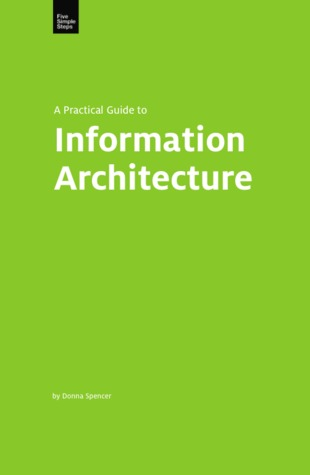 | **A Practical Guide to Information Architecture** - Whether it's organising content, providing clear descriptions or ways for people to get to them, this book is armed with practical advice and examples. [Review](https://boagworld.com/reviews/review-a-practical-guide-to-information-architecture/) | Donna Spencer |
| 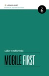 | **Mobile First** - Former Yahoo! design architect and co-creator of Bagcheck Luke Wroblewski knows more about mobile experience than the rest of us, and packs all he knows into this entertaining, to-the-point guidebook. [Review](https://marcabraham.com/2013/07/27/book-review-mobile-first/) | Luke Wroblewski |
| 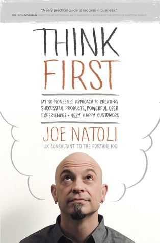 | **Think First: My No-Nonsense Approach to Creating Successful Products, Memorable User Experiences + Very Happy Customers** - Think First serves as a roadmap to building a solid foundation for UX that’s strong enough to withstand any weather as projects move into design and coding. [Review](https://www.uxbooth.com/articles/think-first-a-no-nonsense-approach/) | Joe Natoli |
| 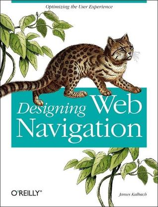 | **Designing Web Navigation** - This book demonstrates that good navigation is not about technology - it's about the ways people find information, and how you guide them. [Review](http://informationr.net/ir/reviews/revs285.html) | James Kalbach |
| 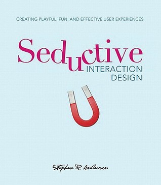 | **Seductive Interaction Design: Creating Playful, Fun, and Effective User Experiences** - The author takes a fresh approach to designing sites and interactions based on the stages of seduction. This beautifully designed book examines what motivates people to act. [Review](https://www.uxbooth.com/articles/seductive-interaction-design-a-ux-booth-book-review/) | Stephen P. Anderson |
| 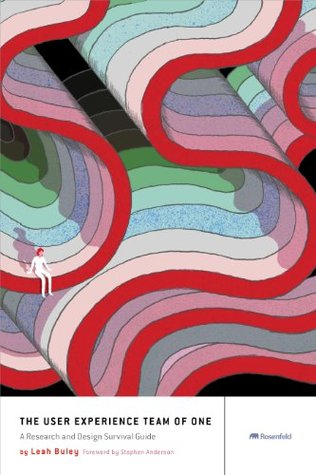 | **The User Experience Team of One: A Research and Design Survival Guide** - The book prescribes a range of approaches that have big impact and take less time and fewer resources than the standard lineup of UX deliverables. [Review](https://andermel.medium.com/book-review-the-ux-team-of-one-by-leah-buley-9ede2cabf7ee) | Leah Buley |
| 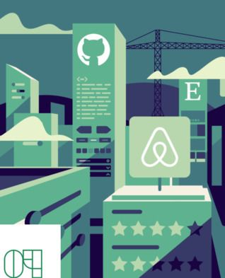 | **Design Systems Handbook** - A design system unites product teams around a common visual language. It reduces design debt, accelerates the design process, and builds bridges between teams working in concert to bring products to life. Learn how you can create your design system and help your team improve product quality while reducing design debt. [Website](https://www.designbetter.co/design-systems-handbook) | Marco Suarez, Jina Anne, Katie Sylor-Miller, Diana Mounter, and Roy Stanfield |
| 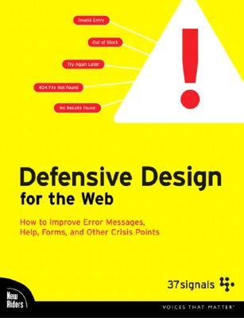 | **Defensive Design for the Web: How to Improve Error Messages, Help, Forms, and Other Crisis Points** - This book shows the right (and wrong) ways to get defensive, offers guidelines to prevent errors and rescue customers if a breakdown occurs. [Review](http://www.digital-web.com/articles/defensive_design_for_the_web/) | Matthew Linderman & Jason Fried |
| 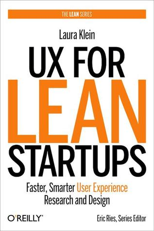 | **UX for Lean Startups** - UX expert Laura Klein shows you what it takes to gather valuable input from customers, build something they’ll truly love, and reduce the time it takes to get your product to market. [Review](https://uxbookreviews.com/2016/08/03/ux-for-lean-startups/) | Laura Klein |
| 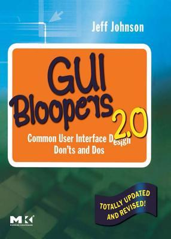 | **GUI Bloopers 2.0: Common User Interface Design Don'ts and DOS** - The book looks at user interface design bloopers from commercial software, Web sites, Web applications, and information appliances, explaining how intelligent, well-intentioned professionals make these mistakes--and how you can avoid them. [Review](https://stcsig.org/book-review-gui-bloopers-by-jeff-johnson/) | Jeff Johnson |
| 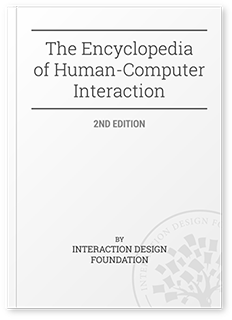 | **The Encyclopedia of Human-Computer Interaction, 2nd Ed.** - The textbooks are assembled in a gigantic 4000+ page encyclopedia covering the design of interactive products and services such as websites, household objects, smartphones, computer software, aircraft cockpits, you name it. [Website](https://www.interaction-design.org/literature/book/the-encyclopedia-of-human-computer-interaction-2nd-ed) | Mads Soegaard & Rikke Friis Dam (eds.) |
| 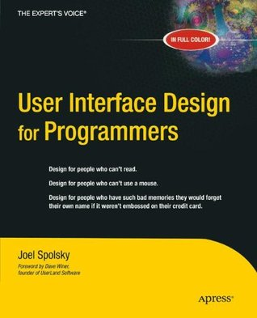 | **User Interface Design for Programmers** - Author proposes simple, logical rules that can be applied without any artistic talent to improve any user interface, from traditional GUI applications to websites to consumer electronics. [Review](https://www.linuxjournal.com/article/5481) | Joel Spolsky |
| 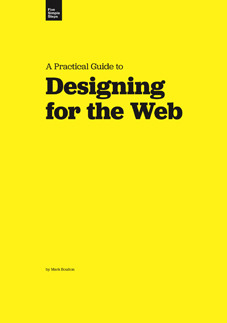 | **A Practical Guide to Designing for the Web** - Learn solid graphic design theory that you can simply apply to your designs, making the difference from a good design to a great one. [Website](http://www.designingfortheweb.co.uk/) / [Review](https://www.designersreviewofbooks.com/2009/05/a-practical-guide-to-designing-for-the-web/) | Mark Boulton |
| 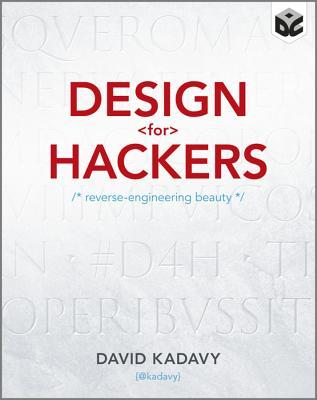 | **Design for Hackers** - By the end of this book, you'll be able to apply the featured design principles to your own web designs, mobile apps, or other digital work. [Website](https://designforhackers.com/) / [Review](https://www.tug.org/books/reviews/tb103reviews-kadavy.html) | David Kadavy |
|  | **Simple and Usable Web, Mobile, and Interaction Design** - This is the first book on the topic of simplicity aimed specifically at interaction designers. It shows how to drill down and simplify user experiences when designing digital tools and applications. [Website](http://www.simpleandusable.com/) / [Review](https://www.uxbooth.com/articles/a-simple-usable-book-review/) | Giles Colborne |
|  | **Just Enough Research** - Learn how to discover your competitive advantages, spot your own blind spots and biases, identify small changes with huge potential impact, and why you should never, ever hold a focus group. [Review](https://marcabraham.com/2017/07/20/book-review-just-enough-research/) | Erika Hall |
| 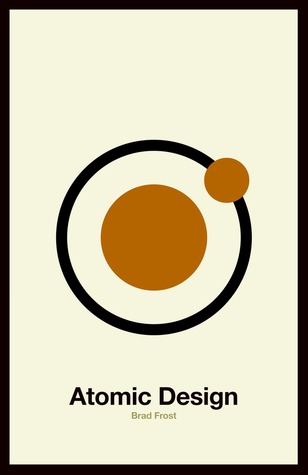 | **Atomic Design** - This book introduces a methodology for thinking of our UIs as thoughtful hierarchies, discusses the qualities of effective pattern libraries, and showcases techniques to transform your team's design and development workflow. [Website](http://atomicdesign.bradfrost.com/table-of-contents/) / [Review](https://benmccormick.org/2018/07/02/book-review-atomic-design/) | Brad Frost |
| 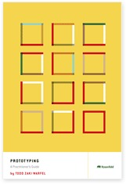 | **Prototyping: A Practitioner's Guide** - Prototyping is a great way to communicate the intent of a design both clearly and effectively. Prototypes help you to flesh out design ideas, test assumptions, and gather real-time feedback from users. [Review](https://learningsolutionsmag.com/articles/827/well-read-prototyping-by-todd-zaki-warfel) | Todd Zaki Warfel |
| 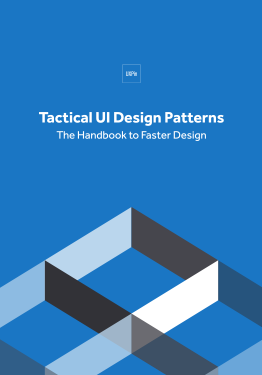 | **Tactical UI Design Patterns: The Handbook to Faster design** - Easy to digest and practical for everyday design. Know how to choose the best UI pattern, prototype patterns, customize patterns, and create your own pattern library. [Website](https://www.uxpin.com/studio/ebooks/ultimate-web-ui-design-pattern-workbook/) | UXPin |
|  | **Ruined by Design: How Designers Destroyed the World, and What We Can Do to Fix It** - This book will fill you with the confidence to do the job the way you always wanted to be able to do it. This book will help you understand your responsibilities. [Review](https://blr.design/blog/review-ruined-by-design/) | Mike Monteiro |
| 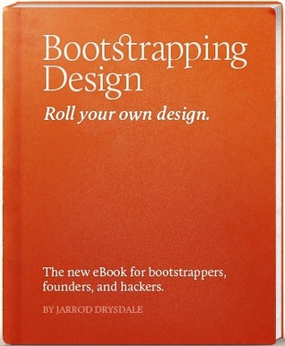 | **Bootstrapping Design** - An eBook teaching design principles to bootstrappers, startup founders, and hackers. Learn easy design strategies to attract more users and help your business succeed. Become the designer your startup needs. [Review](http://blog.8thcolor.com/en/2012/09/bootstrapping-design-review-all-you-have-to-do-is-practice/) | Jarrod Drysdale |
| 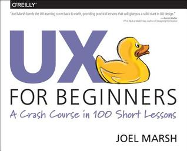 | **UX for Beginners** - With this book, new UX designers will learn the practical skills they need to get started in the field, skills that can be immediately applied to real-world UX projects. [Review](https://www.uxmatters.com/mt/archives/2016/02/book-review-ux-for-beginners-a-crash-course-in-100-short-lessons.php) | Joel Marsh |
| 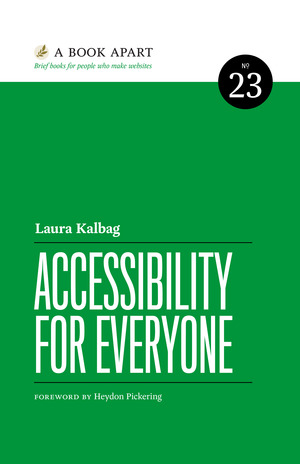 | **Accessibility for everyone** - A guide for the accessibility landscape: understand disability and impairment challenges; get a handle on important laws and guidelines; and learn how to plan for, evaluate, and test accessible design. [Review](https://mobilea11y.com/blog/kalbag-accessibility-for-everyone-review/) | Laura Kalbag |

[back to table of contents](#user-content-contents)

### Articles

- [User Centered Design (UCD)](https://en.wikipedia.org/wiki/User-centered_design) - (User) Human-centered design is an approach to interactive system development that focuses specifically on making systems usable.

- [User Interface Design Basics](https://www.usability.gov/what-and-why/user-interface-design.html) - User Interface (UI) Design focuses on anticipating what users might need.

- [How to Design Voice User Interfaces](https://www.interaction-design.org/literature/article/how-to-design-voice-user-interfaces) - Here, you will learn what the users expect from voice communication and get practical guidelines for how to design great voice user interfaces.

- [Designing Great UIs for Progressive Web Apps](https://medium.com/@owencm/designing-great-uis-for-progressive-web-apps-dd38c1d20f7) - Progressive Web Apps give us an opportunity to reset our expectations and to loudly declare that We Can Do Better when designing user experiences on the web.

- [The Anti-Mac Interface](https://www.nngroup.com/articles/anti-mac-interface/) - We reverse all of the core design principles behind the Macintosh human interface guidelines to arrive at the characteristics of the Internet desktop, by Jakob Nielsen (1996).

- [How to Learn UI Design From Zero-Basis](https://www.mockplus.com/blog/post/how-to-learn-ui-design-from-zerobasis) - Can someone become an UI designer when he does not major in UI?Definitely yes.

- [Component based design. What even is that?](https://tech.ovoenergy.com/getting-started-with-a-component-based-designsystem/) - The benefits of designing & developing with components in mind. Want to know how to get started with a componentised design system? Read on.

- [Learn UI Design by Copying](https://www.uxbeginner.com/learn-ui-design-by-copying/) - It’s not a surprise that we have negative associations with copying, even to this day. But what about copying as a way to learn?

- [Approaches For Multiplatform UI Design Adaptation: A Case Study](https://www.smashingmagazine.com/2015/09/approaches-for-multiplatform-ui-design-adaptation/) - In the case study, authors state that three different scenarios present themselves when developing UIs for multiple platforms.

- [The King vs. Pawn Game of UI Design](http://alistapart.com/article/the-king-vs-pawn-game-of-ui-design) - Try stripping out all the elements that you think you should be including already, and just mess around with the simplest players on the board. Get a feel for the fundamentals, and go from there.

- [Designing a VUI – Voice User Interface](https://www.toptal.com/designers/ui/designing-a-vui) - VUIs are helping to improve all kinds of different user experiences, and some believe that voice will power 50% of all searches by 2020.

- [Gestalt principles in UI design](https://medium.muz.li/gestalt-principles-in-ui-design-6b75a41e9965) - How to become a master manipulator of Visual Communication.

- [Color in UI Design: A (Practical) Framework](https://medium.com/@erikdkennedy/color-in-ui-design-a-practical-framework-e18cacd97f9e) - The fundamental skill of coloring interface designs is being able to modify one base color into many different variations.

- [The ultimate guide to proper use of animation in UX](https://uxdesign.cc/the-ultimate-guide-to-proper-use-of-animation-in-ux-10bd98614fa9) - The main interface animation's principles & rules collected in one place, so that other designers who want to start animating interfaces don’t have to search for additional information.

- [Closing the creative gap](https://hackdesign.org/lessons/56-closing-the-creative-gap) - If you find yourself looking at products and thinking “how the hell do I design something as good as that”, then this is for you.

- [10 UI & UX tips for developers building SaaS apps](https://hackernoon.com/10-ui-ux-tips-for-developers-building-saas-apps-a1f3d74fce2b) - Getting a nice UI/UX on a SaaS app can be a real challenge for developers that know how to code, but struggle with design. Here are my tips on getting the spit & shine on your UI.

- [API design is UI design — a way to collaborative handoff](https://uxdesign.cc/api-design-is-ui-design-a-way-to-collaborative-handoff-3d31ff57bb1) - Designing an API is interface design. Understanding how APIs work help us understand what our medium's capability. Having the knowledge to contribute to an API's design can increase the capability of our UX. This can be essential designer knowledge.

[back to table of contents](#user-content-contents)

### Disciplines

#### Information Architecture

- [What is Information Architecture?](https://www.iainstitute.org/what-is-ia) - Information architecture is the practice of deciding how to arrange the parts of something to be understandable.

- [Visual vocabulary for Information Architecture](http://www.jjg.net/ia/visvocab/) - A visual vocabulary for describing information architecture and interaction design.

- [A Model for Understanding Information Architecture: Ontology, Taxonomy and Choreography](https://www.youtube.com/watch?v=6oaxdq7uqIY) - Understanding where the Information Architecture part is.

- [Information Architecture. Basics for Designers](https://uxplanet.org/information-architecture-basics-for-designers-b5d43df62e20) - Article is devoted to the essence of information architecture and presents the basic points every designer should know.

[back to table of contents](#user-content-contents)

#### Interaction Design

- [Complete Beginner’s Guide to Interaction Design](http://www.uxbooth.com/articles/complete-beginners-guide-to-interaction-design/) - Far from merely working with text and pictures, interaction designers are now responsible for creating every element on the screen that a user might swipe, click, tap, or type: in short, the interactions of an experience.

- [What is Interaction Design: The Practical Framework](https://www.uxpin.com/studio/blog/what-is-interaction-design-the-practical-framework/) - This article will introduce you to the core concepts of interaction design, explaining how to use them to breathe life into your product.

- [Interaction Design Basics](https://www.usability.gov/what-and-why/interaction-design.html) - Introduction to Interaction Design by Usability.gov Team.

#### Universal Design & Accessibility

- [Complete Beginner’s Guide to Universal Design](http://www.uxbooth.com/articles/complete-beginners-guide-to-universal-design/) - While a good design is usable by people of all ages and technical adeptness, a truly universal design works for users with varying physical abilities.

- [The A11Y Project](https://a11yproject.com/) - Community-driven effort to make web accessibility easier.

- [Tips on Designing for Web Accessibility](https://www.w3.org/WAI/gettingstarted/tips/designing) - This page introduces some basic considerations to help you get started making your user interface design and visual design more accessible to people with disabilities.

#### Research

- [Complete Beginner’s Guide to UX Research](http://www.uxbooth.com/articles/complete-beginners-guide-to-design-research/) - Readers will get a head start on how to use these design research techniques in their work, and improve experiences for all users.

- [10 User Research Myths and Misconceptions](https://www.uxmatters.com/mt/archives/2015/11/10-user-research-myths-and-misconceptions.php) - There are still many misconceptions about how to gain an understanding of users and their needs.

- [Cultivating Shared Understanding from Collaborative User Research](https://archive.uie.com/brainsparks/2015/09/11/erika-hall-cultivating-shared-understanding-from-collaborative-user-research/) - Erika Hall on UIE Brain Sparks.

#### Content Strategy

- [The Discipline of Content Strategy](http://alistapart.com/article/thedisciplineofcontentstrategy) - A List Apart article, by Kristina Halvorson.

- [Content Strategy Basics](https://www.usability.gov/what-and-why/content-strategy.html) - Ensuring that you have useful and usable content, that is well structured, and easily found is vital to improving the user experience of a website.

- [Content Strategy for Developers](https://medium.com/talking-microcopy-writing-ux/content-strategy-for-developers-34b635440b91) - If a business was an ocean explorer, then content strategy would be the compass. You can have the best boat, a killer crew and a meticulous map. But without a compass, you won’t know if you’re sailing in the right direction.

- [Complete Beginner’s Guide to Content Strategy](http://www.uxbooth.com/articles/complete-beginners-guide-to-content-strategy/) - Content strategy plans for valuable, findable, meaningful content.

#### Visual Design

- [The Building Blocks of Visual Design](https://www.interaction-design.org/literature/article/the-building-blocks-of-visual-design) - Visual design is about creating and making the general aesthetics of a product consistent.

### Courses

- [User Interface Design Specialization / COURSERA](https://coursera.org/specializations/user-interface-design) - Design Better User Interfaces. Learn to create effective and usable interfaces for a range of products and devices. **FREEMIUM** / Video course

- [Intro to the Design of Everyday Things / UDACITY](https://www.udacity.com/course/intro-to-the-design-of-everyday-things--design101) - Summary of key concepts from the first two chapters of The Design of Everyday Things by Don Norman. **FREE** / Video course

- [Hack Design / SITE](https://hackdesign.org/) - Easy to follow design course for people who do amazing things. **FREE** / Email course

- [Learn UI Design / SITE](https://learnui.design/) - Confidently design beautiful user interfaces for any app or site. **PAID** / Video course

- [Evaluating User Interfaces / COURSERA](https://www.coursera.org/learn/ui-testing) - In this course you will learn and practice several techniques for user interface evaluation. **FREEMIUM** / Video course

- [User Interface (UI) Personalization / edX](https://www.edx.org/es/course/user-interface-ui-personalization-mitx-hdm1-2ax) - You will learn the fundamentals of user interface personalization in the context of web sites and web applications. **FREEMIUM** / Video course

- [Free UI Design Short Course / CAREERFOUNDRY](http://info.careerfoundry.com/ui-design/ui-short-course-emails) - Get a glimpse of the research and planning going on behind the scenes with this free, 7-day, UI Design Short Course. **FREE** / Email course

- [UI Design / DESIGN LAB](http://trydesignlab.com/ui-design-course/) - Dive into the theory and techniques you need to make beautiful web and mobile interfaces in this 4-week online course. **PAID** / Video course

- [Interaction Design Specialization / COURSERA](https://www.coursera.org/specializations/interaction-design) - Learn how to design great user experiences. Design that delights users. **FREEMIUM** / Video course

- [Interaction Design Fundamentals / LYNDA](https://www.lynda.com/Dreamweaver-CS5-training/Interaction-Design-Fundamentals/82822-2.html) - Author David Hogue sheds light on designing effective interactions for any digital medium. **FREEMIUM** / Video course

- [Screens Essentials for UI Designers / UDEMY](https://www.udemy.com/screens-essentials-for-ui-designers/) - You will find plenty of tutorials and articles on how screen design essentials work with explanation of terms and key techniques. **FREE** / Video course

- [The 90-Minute UX Audit + UI Redesign](https://learn.givegoodux.com/p/90-minute-web-portal-audit-and-redesign) - The faster, simpler way to quickly identify critical UX issues — just by looking at the UI. **PAID** / Video course

- [Design Rules: Fundamental Principles + Practices for Great UI Design / SKILLSHARE](https://www.skillshare.com/classes/DESIGN-RULES-Fundamental-Principles-Practices-for-Great-UI-Design/739408485) - By the time you finish Design Rules, you'll be able to do much more than create a more beautiful User Interface. Instead, you'll be able to design a UI that truly works for the people who use it. **PAID** / Video course

- [The 2019 UI Design Crash Course for Beginners / YOUTUBE](https://www.youtube.com/watch?v=_Hp_dI0DzY4) - In this course, Gary Simon will help answer that question and provide you with a blueprint that's going to speed up your transition from producing ugly UI's as a beginner, to producing fantastic UI's. **FREE** / Video course

- [Learn UI Design Fundamentals / SCRIMBA](https://scrimba.com/g/gdesign) - This course will teach you to build browser-based user interfaces that both look good and work well. All is done with HTML and CSS, so no clunky design tools needed. **FREE** / Video course

- [DesignAcademy / SITE](https://www.designacademy.io/free-course/) - Learn the basics of design in just 6 days. **FREE** / Email course

[back to table of contents](#user-content-contents)

### Design Systems

- [A comprehensive guide to design systems](https://www.invisionapp.com/blog/guide-to-design-systems/) - Let’s dig into the fundamentals of design systems, plan how you can build and implement one in your organization, and explore several examples of organizations that are using design systems to drive success.
- [Researching Design Systems](https://medium.com/startup-grind/researching-design-systems-2e462d28bc70) - Physical and digital highlighter in hand and pixels, I pored over some of more popular design systems out there to see what insights I could glean. _By Dan Mall_.
- [Designing UI Guidelines](https://wiredcraft.com/blog/designing-ui-guidelines/) - User interface is easy to make a mess out of. It doesn’t matter if you are a guru or just dabbling, inconsistencies in the design will most probably arise.
- [Design System in Figma](https://designcode.io/figma/) - A design system helps your team build modern products faster and more consistently. This is the starting point of bridging design and development.
- [Design System Repo](https://designsystemsrepo.com/) - A frequently updated collection of Design System examples, articles, tools and talks.

#### Examples

- [Material Design](https://material.io/) - Unified system that combines theory, resources, and tools for crafting digital experiences, by Google.

- [Fluent Design System](https://www.microsoft.com/design/fluent/) - It’s a collective approach to creating simplicity and coherence through a shared, open design system across platforms, by Microsoft.

- [Ant Design](https://ant.design/) - UI Design Language, by Ant Financial.

- [Apple Human Interface Guidelines](https://developer.apple.com/design/human-interface-guidelines/) - Get in-depth information and UI resources for designing great apps that integrate seamlessly with Apple platforms.

- [Carbon Design System](https://www.carbondesignsystem.com/) - Carbon is IBM’s open-source design system for digital products and experiences.

- [Duolingo Design](https://www.duolingo.com/design/) - Brand design and user interfaces of Duolingo.

- [Mozilla Style Guide](http://www.mozilla.org/en-US/styleguide/) - This guide serves as a resource to bring together all our brands and to help define their visual and stylistic elements.

- [Clarity Design System](https://vmware.github.io/clarity/) - UX guidelines, HTML/CSS framework, and Angular components working together to craft exceptional experiences.

- [Photon Design System](https://design.firefox.com/photon/) - Launch recognizable, enjoyable Firefox products and features faster.

- [KaiOS Design Guide](https://developer.kaiostech.com/design-guide) - This visual style guide serves as a resource for designers and  developers, to help define the visual style for your KaiOS applications.

[back to table of contents](#user-content-contents)

### Patterns

- [GoodUI](http://www.goodui.org/) - Here is a running idea list which we're actively testing and turning into highly effective conversion patterns (real evidence-based stuff).

- [UI Patterns.io](http://uipatterns.io/) - Explore & play with interactive UI design patterns and learn how to solve common UI problems.

- [UI-Patterns.com](http://ui-patterns.com/) - User Interface Design patterns are recurring solutions that solve common design problems.

- [Mobile Patterns](http://www.mobile-patterns.com/) - Library of iOS and Android screenshots for designers and developers to reference.

- [Pttrns](https://pttrns.com/) - The mother of all design resources.

- [UI Garage](https://uigarage.net/) - All the latest UI Design Inspiration and UI Patterns collected in one place.

- [Dark Patterns](https://darkpatterns.org/) -  The purpose of this site is to spread awareness and to shame companies that use tricks in websites and apps that make you buy or sign up for things that you didn't mean to.

- [Android From Scratch: Common UI Design Patterns](https://code.tutsplus.com/tutorials/android-from-scratch-common-ui-design-patterns--cms-26044) - In this tutorial, you learn about a few of these patterns and how they can help your users by creating a great experience when using your app.

- [10 UI Design Patterns You Should Be Paying Attention To](https://www.smashingmagazine.com/2009/06/10-ui-design-patterns-you-should-be-paying-attention-to/) - This article goes over 10 interesting UI design patterns that you can use in your own projects.

- [User Interface Elements](https://www.usability.gov/how-to-and-tools/methods/user-interface-elements.html) - Whether they are aware of it or not, users have become familiar with elements acting in a certain way, so choosing to adopt those elements when appropriate will help with task completion, efficiency, and satisfaction.

- [Inclusive Components](https://inclusive-components.design/) - Blog trying to be a pattern library. All about designing inclusive web interfaces, piece by piece.

- [MODALZMODALZMODALZ](https://modalzmodalzmodalz.com/) - We use too many damn modals. Let's just not.

[back to table of contents](#user-content-contents)

### Techniques

#### Think Aloud

- [Thinking Aloud: The #1 Usability Tool](https://www.nngroup.com/articles/thinking-aloud-the-1-usability-tool/) - "The method it serves as a _window on the soul_, letting you discover what users really think about your design. [...] You usually learn why users guess wrong about some parts of the UI and why they find others easy to use."

#### Five seconds test

- [Five-Second Testing](https://usabilityhub.com/guides/five-second-testing) - Form of usability testing that allows you to determine whether a design quickly communicates an intended message or impression. It can provide both quantitative and qualitative feedback that lets you optimize a design and encourages iterative improvement.

#### Usability (expert) reviews

- [A guide to carrying out usability reviews](http://www.uxforthemasses.com/usability-reviews/) - In this article, author walkthrough a method for examining the usability of an interactive system (website, application, mobile app etc.) by using a combination of a scenario based and heuristic (i.e. best practice guidelines) based review.

#### Style Tiles

- [Style Tiles](http://styletil.es/) - Help form a common visual language between the designers and the stakeholders and provide a catalyst for discussions around the preferences and goals of the client.

#### Usability Testing

- [The 1-page usability test plan](https://www.userfocus.co.uk/articles/usability_test_plan_dashboard.html) - A critical document to help you manage and organise a usability test. But it can sometimes appear too documentation-heavy in agile environments. What would a usability test plan look like if it was re-envisioned as a single page?

#### Card Sorting

- [Card Sorting: A Definitive Guide](http://boxesandarrows.com/card-sorting-a-definitive-guide/) - Card sorting is a great, reliable, inexpensive method for finding patterns in how users would expect to find content or functionality.

#### Design Libs

- [Design Libs](https://www.designlibs.com/index.html) - Your go-to reference for how to write and use some of the most common design thinking exercises, practices, and methods.

[back to table of contents](#user-content-contents)

### Newsletters

- [Sidebar.io](https://sidebar.io/) - The five best design links, every day, by Sacha Greif.

- [Web Tools Weekly](https://webtoolsweekly.com/) - Front-end development and web design newsletter with a focus on tools.

- [The UI Animation Newsletter](http://uianimationnewsletter.com/) - Weekly web animation resources & inspiration, by Val Head.

- [UX Design Weekly](http://uxdesignweekly.com/) - Hand picked list of the best user experience design links every week.

- [HeyDesigner](https://heydesigner.com/) - Daily curated newsfeed for product people, UXers, PMs and frontend developers.

- [UX Notebook](https://www.sarahdoody.com/ux-newsletter/) - The UX Notebook is a UX newsletter curated by Sarah Doody.

- [UIRecipes](https://uirecipes.com/) - Learn UI Design in 15 Minutes a Week.

- [UI Design Daily](https://uidesigndaily.com/) - Weekly FREE UI resources straight to your inbox.

[back to table of contents](#user-content-contents)

### Websites & Blogs

- [UX Booth](http://www.uxbooth.com/) - Publication by and for the user experience community.

- [Boxes and Arrows](http://boxesandarrows.com/category/interfaces/) - Devoted to the practice, innovation, and discussion of design; including graphic design, interaction design, information architecture and the design of business.

[back to table of contents](#user-content-contents)

### Communities

- [Information Architecture Institute](https://www.iainstitute.org/) - A nonprofit organization of volunteers with a singular focus: to make the world's information clearer and easier to use by improving how people learn, practice and teach Information Architecture (IA).

- [Interaction Design Association](https://ixda.org/) - Global community of people who share an interest in interaction design.

- [Hacking UI](http://hackingui.com/) - Community for designers, developers and creative entrepreneurs with a passion.

- [Interaction Design Foundation](https://www.interaction-design.org/community) -  Community-based career development: 449 groups in 88 countries.

- [User Experience Professionals Association](http://uxpa.org/) - UXPA International supports people who research, design, and evaluate the user experience (UX) of products and services.

[back to table of contents](#user-content-contents)

## Tools

### Pen & Paper

- [Interaction design starts on paper](https://medium.com/beakerandflint/interaction-design-starts-on-paper-a2baa91acc45) - Create beautiful UI through better wireframes.

- [UI Sketching – How to Make It Right and Why You Should Do This in All Projects](http://uxmisfit.com/2017/11/12/ui-sketching-how-to-make-it-right-and-why-you-should-do-this-in-all-projects/) - UI Sketching is, of course, kind of drawing on a paper… but it is not a usual drawing – its purpose is to reveal the result of problem-solving thinking.

### Design Apps

- [Sketch](https://www.sketchapp.com/) - Sketch is a design toolkit built to help you create your best work — from your earliest ideas, through to final artwork. **Mac only**

- [Alva](https://meetalva.io/) - Alva lets you design interactive products based on the same components your engineers are using for production websites.

- [Figma](https://www.figma.com/) - Figma is the first interface design tool based in the browser, making it easier for teams to create software.

- [Marvel](https://marvelapp.com/) - Simple design, prototyping and collaboration.

- [InVision](https://www.invisionapp.com/) - The Digital Product Design platform powering the world’s best user experiences.

- [Adobe XD](http://www.adobe.com/products/xd.html) - The all-in-one UX/UI solution for designing websites, mobile apps, and more.

- [UXPin](https://www.uxpin.com/) - The Full-Stack UX Design Platform

- [Webflow](https://webflow.com/) - Gives designers and developers the power to design, build, and launch responsive websites visually, while writing clean, semantic code for you.

- [MockFlow](https://www.mockflow.com/) - Super-easy wireframing and UX suite for designers.

- [Framer](https://framer.com/) - Design everything from detailed icons to high-fidelity interactions—all in one place.

- [Atomic](https://atomic.io/) - Advanced interactive design features like logic, data, and variables, into the hands of every designer.

- [Affinity Designer](https://affinity.serif.com/en-us/designer/) - Professional graphic design software for desktop and iPad.

- [Pencil](http://pencil.evolus.vn/) - An open-source GUI prototyping tool that's available for ALL platforms.

[back to table of contents](#user-content-contents)

### Complementary tools

- [Modular Scale](https://www.modularscale.com/) - Tool to help web designers size their type in a more meaningful way.

- [Grid calculator](http://gridcalculator.dk/) - Download your grid as Illustrator, Photoshop or PNG files with a pre-made guides ready to go.

- [WebAIM Color Contrast Checker](https://webaim.org/resources/contrastchecker/) - Enter a foreground and background color in RGB hexadecimal format or choose a color using the color picker.

### Testing Apps

#### Usability testing

- [POP. Prototyping on paper](https://marvelapp.com/pop/) - POP helps you transform your pen and paper ideas into an interactive iPhone or Android prototype.

- [UserTesting](https://www.usertesting.com/) - User Experience Research Platform.

- [Loop11](https://www.loop11.com/) - Informed design decisions built from numbers & stories.

#### Technical testing

- [Testing with Xcode](https://developer.apple.com/library/content/documentation/DeveloperTools/Conceptual/testing_with_xcode/chapters/09-ui_testing.html) - UI testing gives you the ability to find and interact with the UI of your app in order to validate the properties and state of the UI elements.

[back to table of contents](#user-content-contents)

### Languages

#### HTML

- [HTML, from MDN](https://developer.mozilla.org/en-US/docs/Learn/HTML) - To build websites, you should know about HTML — the fundamental technology used to define the structure of a webpage.

- [HTML Reference](http://htmlreference.io/) - Free guide to HTML. It features all elements and attributes.

- [HTML Fundamentals](https://www.sololearn.com/Course/HTML/) - SoloLearn interactive HTML tutorial is comprised of carefully selected content, quizzes, and checkpoints to ensure that you learn as much as possible, while also having as much fun as possible.

- [Learn to Code HTML & CSS](https://learn.shayhowe.com/html-css/) - Outlining the fundamentals, this guide works through all common elements of front-end design and development.

- [The Best HTML and HTML5 Tutorials](https://www.freecodecamp.org/news/best-html-html5-tutorial/) - HyperText Markup Language (HTML) is a markup language used to construct online documents and is the foundation of most websites today.

#### CSS

- [CSS, from MDN](https://developer.mozilla.org/en-US/docs/Learn/CSS) - While HTML is used to define the structure and semantics of your content, CSS is used to style it and lay it out.

- [CSS Reference](http://cssreference.io/) - Free visual guide to CSS. It features the most popular properties, and explains them with illustrated and animated examples.

- [Marksheet - CSS Basics](http://marksheet.io/css-basics.html) - For developers eager to learn how CSS can define the style and layout of a webpage.

- [CSS Grid Guide](https://cssgrid.cc/css-grid-guide.html) - The CoffeeCup Guide to liberating layout through CSS Grid.

- [CSS Cheat Sheet](https://adam-marsden.co.uk/css-cheat-sheet/) - Reference for CSS goodness.

- [CSS Animations](https://css-animations.io/) - Hello, animation!

[back to table of contents](#user-content-contents)

#### Javascript

- [JavaScript, from MDN](https://developer.mozilla.org/en-US/docs/Web/JavaScript) - Prototype-based, multi-paradigm, dynamic language, supporting object-oriented, imperative, and declarative (e.g. functional programming) styles. Learn how to program in JavaScript with guides and tutorials.

- [Bestof.JS](https://bestof.js.org/) - Check out the most popular open-source projects and the latest trends about the web platform and node.js.

- [FreeCodeCamp](https://www.freecodecamp.org/map) - Learn to code for free.

### Libraries & Frameworks

#### CSS Only

- [Pure.css](https://purecss.io/) - Set of small, responsive CSS modules that you can use in every web project.

- [Milligram](https://milligram.io/) - Minimalist CSS framework.

- [Bulma](https://bulma.io/) - Modern CSS framework based on Flexbox.

- [Basscss](http://basscss.com/) - Lightning Fast Modular CSS with No Side Effects.

- [Skeleton](http://getskeleton.com/) - Dead simple, responsive boilerplate.

- [Lit](https://ajusa.github.io/lit/) - World's smallest responsive css framework.

- [Tailwind CSS](https://tailwindcss.com/) - A Utility-First CSS Framework for Rapid UI Development.

- [Picnic CSS](https://picnicss.com/) - Lightweight and beautiful library.

- [Animate.css](https://animate.style/) - Just-add-water CSS animations.

- [Chota](https://jenil.github.io/chota/) - A micro (~3kb) CSS framework.

[back to table of contents](#user-content-contents)

#### Javascript Only

- [Vue.js](https://vuejs.org/) - The Progressive JavaScript Framework

- [React](https://reactjs.org/) - JavaScript library for building user interfaces

- [Angular](https://angular.io/) - One framework. Mobile & desktop.

- [Moment.js](http://momentjs.com/) - Parse, validate, manipulate, and display dates and times in JavaScript.

- [Reef](https://reefjs.com/) - A lightweight library for creating reactive, state-based components and UI.

[back to table of contents](#user-content-contents)

#### CSS + Javascript

- [Semantic UI](https://semantic-ui.com/) - User Interface is the language of the web.

- [UIkit](https://getuikit.com/) - Lightweight and modular front-end framework for developing fast and powerful web interfaces.

- [Bootstrap](http://getbootstrap.com/) - Build responsive, mobile-first projects on the web with the world's most popular front-end component library.

- [Foundation](https://get.foundation/) - The most advanced responsive front-end framework in the world.

- [Materialize](http://materializecss.com/) - Modern responsive CSS framework based on Material Design by Google.

- [Metro UI CSS](https://metroui.org.ua/) - The front-end framework for developing projects on the web in Windows Metro Style

- [Office UI Fabric](https://developer.microsoft.com/en-us/fabric) - The official front-end framework for building experiences that fit seamlessly into Office and Office 365.

- [HTML5 Boilerplate](https://html5boilerplate.com/) - The web’s most popular front-end template

- [Material-UI](https://material-ui.com/) - React components that implement Google's Material Design.

- [Framework7](http://framework7.io/) - Full featured HTML framework for building iOS & Android apps.

- [Element](http://element.eleme.io/) - Vue 2.0 based component library for developers, designers and product managers.

- [Shoelace](https://shoelace.style/) - Back to the basics CSS starter kit. For when you don’t need the whole boot.

- [AT UIKIT](https://at-ui.github.io/at-ui/#/en) - Lightweight and Modular Front-End UI Library.

- [Frend](https://frend.co/) - Collection of accessible, modern front-end components.

- [Vuesax](https://lusaxweb.github.io/vuesax/) - Frontend Vue components.

- [Onsen](https://onsen.io/) - The most beautiful and efficient way to develop HTML5 hybrid and mobile web apps.

[back to table of contents](#user-content-contents)

### Tools

- [Storybook](https://storybook.js.org/) - The UI Development Environment You'll ♥️ to use.

- [React Styleguidist](https://react-styleguidist.js.org/) - Isolated React component development environment with a living style guide.

- [VUEDS](https://vueds.com/) - An open source tool for building Design Systems with Vue.js.

- [Fractal](https://fractal.build/) - Powerful component libraries & styleguides that fit the way you work.

## Resources

### Inspiration

- [Ui Parade](http://www.uiparade.com/) - User Interface Design Inspiration.

- [CollectUI](https://collectui.com/) - Daily inspiration collected from daily ui archive and beyond. Hand picked, updating daily.

- [UI Movement](https://uimovement.com/) - UI Movement is a community of design enthusiasts who share and discuss the most interesting and unique UI designs.

- [Inspiration UI](http://inspirationui.com/) - Inspiration UI  is a community that aims to provide the best design resources for those who create for the web.

- [UPlabs - Web](https://www.uplabs.com/web) - Hand-picked Web UI Elements.

- [Dribbble](https://dribbble.com/tags/ui) - Show and tell for designers.

- [Little Big Details](http://littlebigdetails.com/) - Curated collection of the finer details of design, updated every day.

- [Little UI Details](https://twitter.com/i/moments/880688233641848832) - Collections of little tips from Steve Schoger to improve your visual design skills with the little details that make a big difference.

- [Inspired UI](http://inspired-ui.com/) - Mobile Apps Design Patterns [iPhone]

- [Calltoidea](http://calltoidea.com/) - Light up your imagination!

- [UI Design Interactions](https://www.uisources.com/interactions) - New apps added every week.

- [Nicely done](http://nicelydone.club/patterns/) - Products & pattern designs inspiration.

[back to table of contents](#user-content-contents)

### Freebies

- [Freeui.design](https://freeui.design/) - Free UI Design for Designers.

- [UIGradients](https://uigradients.com/) - Beautiful colour gradients for design and code.

- [FreebiesUI](http://freebiesui.com/) - FreebiesUI is an ever-growing collection of quality UI resources designed by talented creatives who choose to share their work for free with the rest of the community.

- [Freebie Supply](https://freebiesupply.com/) - Free, high quality design resources for Photoshop, Sketch, Illustrator, Adobe XD and Figma.

- [XD Guru](https://www.xdguru.com/) - The biggest collection of free & premium resources for Adobe XD.

- [Sketch App Sources](https://www.sketchappsources.com/) - We curate hundreds of icons and UI kits for web and mobile to help you design, prototype, learn, and ideate faster.

- [UI Space](https://uispace.net/) - Thousand of great freebies. Search for an high quality and Hand-crafted freebie.

- [UI8 Freebies](https://www.ui8.net/categories/freebies) - 209 awesome design freebies to get your creative juices flowing.

- [UICloud](http://ui-cloud.com/) - The largest user interface design database in the world.

- [Android Nougat Free GUI](https://materialdesignkit.com/android-gui/) - Based on system and native app's screens from Android 7.0 Nougat.

- [Figma Freebies](http://figmafreebi.es/) - A collection of design resources for the figma community.

- [Interfacer](https://interfacer.xyz/) - Collection of more than 200+ free design resources.

- [UI Store](https://www.uistore.design/) - Free Handpicked UI Kits for your real life projects.

- [UI Design Daily](https://uidesigndaily.com/) - 1000+ open-source UI designs.

- [Design Gradients](https://www.designgradients.com/) - The free platform of 48 linear gradients curated by designers.

[back to table of contents](#user-content-contents)

#### Colors

- [Color Hunt](http://www.colorhunt.co/) - The collection serves thousands of different hand-picked color palettes and is growing everyday.

- [Coolors](https://coolors.co/) - The super fast color schemes generator!

- [Picular](https://picular.co/) - Google, but for colors.

- [ColorBox](https://www.colorbox.io/) - Created by Lyft Design, Colorbox is a color tool to produce color sets.

- [ShadeSwash](https://shadeswash.netlify.app/) - Quickly generate shades of any color.

- [Poolors](https://poolors.com) - Color combos most used by designers.

#### Icons

- [Font Awesome](https://fontawesome.com/) - Get vector icons and social logos on your website with Font Awesome, the web’s most popular icon set and toolkit.

- [Bytesize](https://danklammer.com/bytesize-icons/) - Tiny style-controlled SVG iconset.

- [Heroicons UI](https://github.com/sschoger/heroicons-ui) - Set of 104 free premium SVG icons.

- [We Love SVG: Free SVG Files](https://icons8.com/welovesvg) - Open source library that allows embedding icons from any icon library.

- [Iconstore](https://iconstore.co/) - Free Icons by First-Class Designers.

- [SimpleSVG](https://simplesvg.com/) - Modern replacement for glyph fonts. One library, thousands of icons.

#### Fonts

- [Fontsquirrel](https://www.fontsquirrel.com/) - All things fonts, font-face, and webfonts. FREE, hand-picked, high-quality, commercial-use fonts, even if that means we send you elsewhere to get them.

- [Google Fonts](https://fonts.google.com/) - Making the web more beautiful, fast, and open through great typography.

### APIs

- [Unsplash](https://unsplash.com/developers) - A modern JSON API that surfaces all of the info you'll need to build any experience for your users.

- [DataFakeGenerator](http://www.datafakegenerator.com/) - Useful tool in the creation of data for use cases.

- [Random User](https://randomuser.me/) - A free, open-source API for generating random user data. Like Lorem Ipsum, but for people.

- [Public APIs](https://github.com/n0shake/Public-APIs) - A public list of APIs from round the web.

[back to table of contents](#user-content-contents)